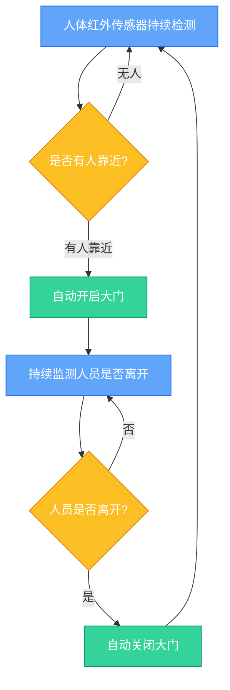

```mermaid
graph TD
  classDef trigger fill:#60a5fa,stroke:#2563eb,color:#fff
  classDef decision fill:#fbbf24,stroke:#d97706,color:#fff
  classDef action fill:#34d399,stroke:#059669,color:#fff
  classDef display fill:#a78bfa,stroke:#7c3aed,color:#fff
  A[人体红外传感器持续检测]:::trigger --> B{是否有人靠近?}:::decision
  B -->|有人靠近| C[自动开启大门]:::action
  B -->|无人| A
  C --> D[持续监测人员是否离开]:::trigger
  D --> E{人员是否离开?}:::decision
  E -->|否| D
  E -->|是| F[自动关闭大门]:::action
  F --> A
```
