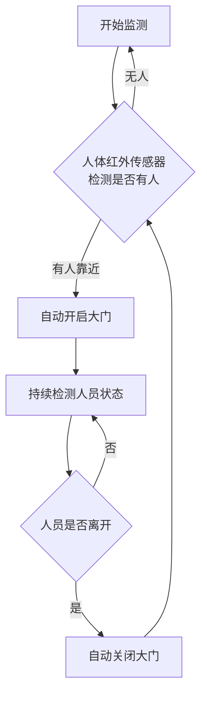

```mermaid
flowchart TD
    A[开始监测] --> B{人体红外传感器\n检测是否有人}
    B -- 有人靠近 --> C[自动开启大门]
    C --> D[持续检测人员状态]
    D --> E{人员是否离开}
    E -- 否 --> D
    E -- 是 --> F[自动关闭大门]
    F --> B
    B -- 无人 --> A
```
