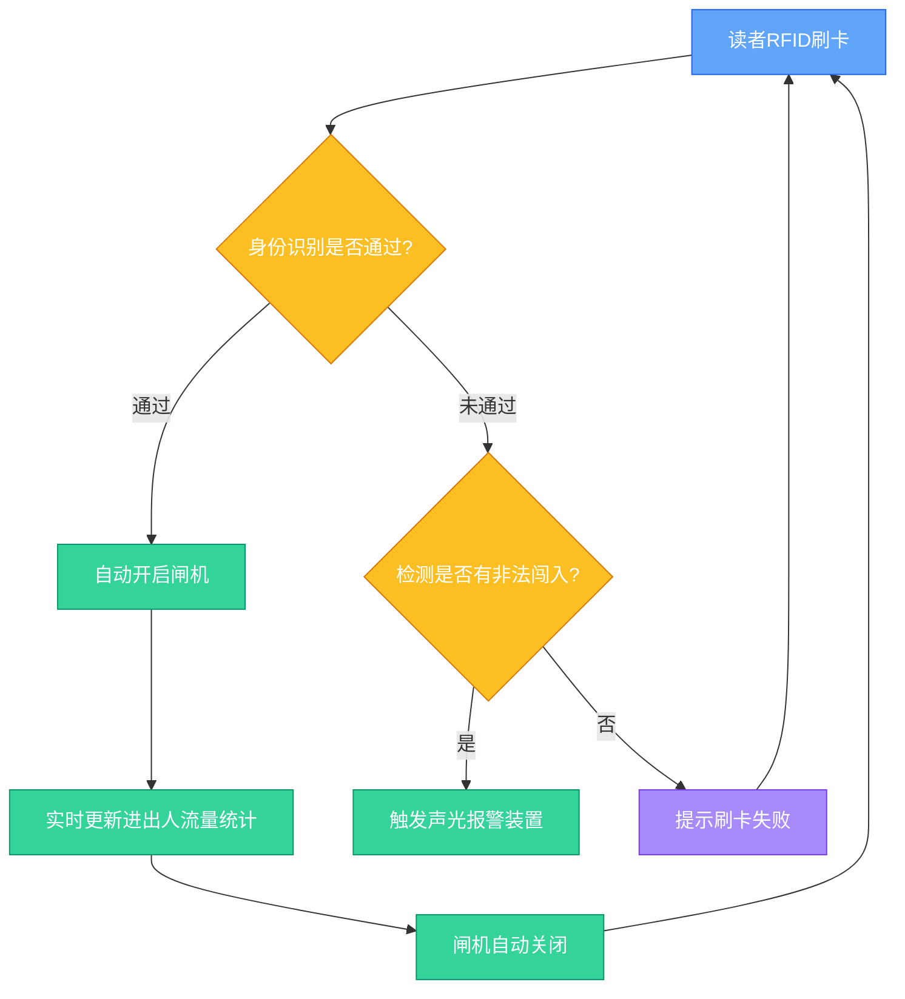

```mermaid
graph TD
  classDef trigger fill:#60a5fa,stroke:#2563eb,color:#fff
  classDef decision fill:#fbbf24,stroke:#d97706,color:#fff
  classDef action fill:#34d399,stroke:#059669,color:#fff
  classDef display fill:#a78bfa,stroke:#7c3aed,color:#fff
  A[读者RFID刷卡]:::trigger --> B{身份识别是否通过?}:::decision
  B -->|通过| C[自动开启闸机]:::action
  C --> D[实时更新进出人流量统计]:::action
  D --> E[闸机自动关闭]:::action
  E --> A
  B -->|未通过| F{检测是否有非法闯入?}:::decision
  F -->|是| G[触发声光报警装置]:::action
  F -->|否| H[提示刷卡失败]:::display
  H --> A
```
