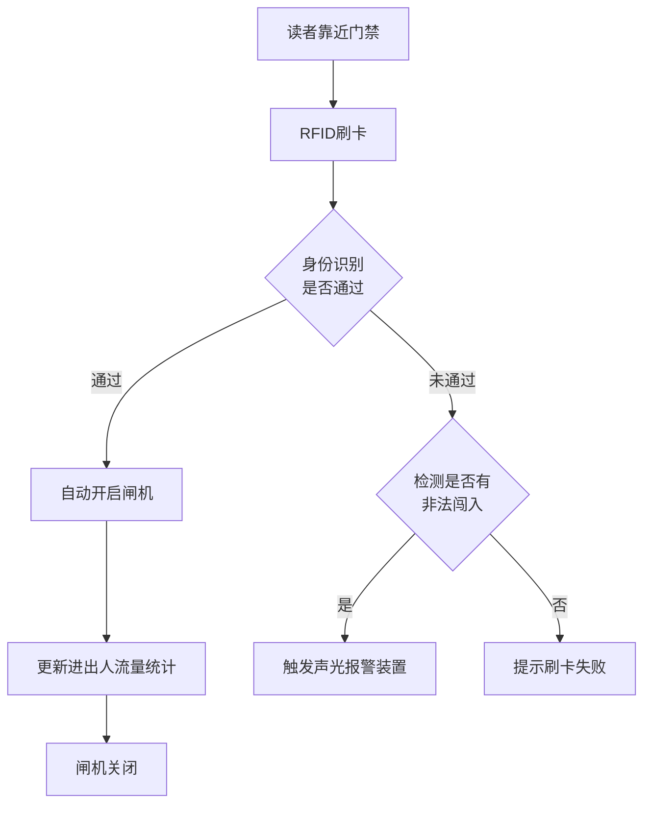

```mermaid
flowchart TD
    A[读者靠近门禁] --> B[RFID刷卡]
    B --> C{身份识别\n是否通过}
    C -- 通过 --> D[自动开启闸机]
    D --> E[更新进出人流量统计]
    E --> F[闸机关闭]
    C -- 未通过 --> G{检测是否有\n非法闯入}
    G -- 是 --> H[触发声光报警装置]
    G -- 否 --> I[提示刷卡失败]
```
