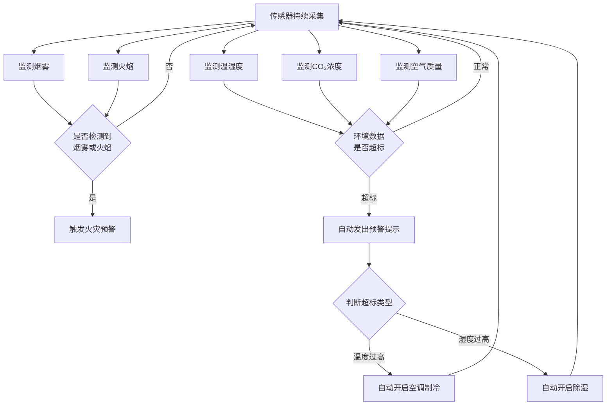

```mermaid
flowchart TD
    A[传感器持续采集] --> B[监测温湿度]
    A --> C[监测CO₂浓度]
    A --> D[监测空气质量]
    A --> E[监测烟雾]
    A --> F[监测火焰]
    B --> G{环境数据\n是否超标}
    C --> G
    D --> G
    E --> H{是否检测到\n烟雾或火焰}
    F --> H
    H -- 是 --> I[触发火灾预警]
    H -- 否 --> A
    G -- 超标 --> J[自动发出预警提示]
    J --> K{判断超标类型}
    K -- 温度过高 --> L[自动开启空调制冷]
    K -- 湿度过高 --> M[自动开启除湿]
    L --> A
    M --> A
    G -- 正常 --> A
```
