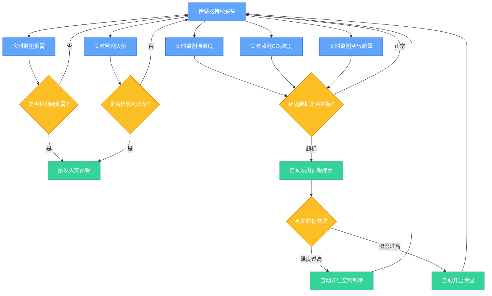

```mermaid
graph TD
  classDef trigger fill:#60a5fa,stroke:#2563eb,color:#fff
  classDef decision fill:#fbbf24,stroke:#d97706,color:#fff
  classDef action fill:#34d399,stroke:#059669,color:#fff
  classDef display fill:#a78bfa,stroke:#7c3aed,color:#fff
  A[传感器持续采集]:::trigger --> B[实时监测温湿度]:::trigger
  A --> C[实时监测CO₂浓度]:::trigger
  A --> D[实时监测空气质量]:::trigger
  A --> E[实时监测烟雾]:::trigger
  A --> F[实时监测火焰]:::trigger
  E --> G{是否检测到烟雾?}:::decision
  G -->|是| H[触发火灾预警]:::action
  G -->|否| A
  F --> I{是否检测到火焰?}:::decision
  I -->|是| H
  I -->|否| A
  B --> J{环境数据是否超标?}:::decision
  C --> J
  D --> J
  J -->|正常| A
  J -->|超标| K[自动发出预警提示]:::action
  K --> L{判断超标类型}:::decision
  L -->|温度过高| M[自动开启空调制冷]:::action
  L -->|湿度过高| N[自动开启除湿]:::action
  M --> A
  N --> A
```
