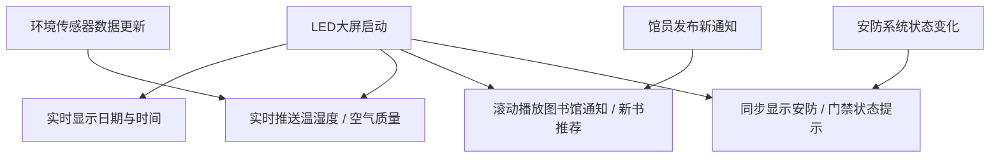

```mermaid
flowchart TD
    A[LED大屏启动] --> B[实时显示日期与时间]
    A --> C[实时推送温湿度 / 空气质量]
    A --> D[滚动播放图书馆通知 / 新书推荐]
    A --> E[同步显示安防 / 门禁状态提示]
    F[环境传感器数据更新] --> C
    G[安防系统状态变化] --> E
    H[馆员发布新通知] --> D
```
