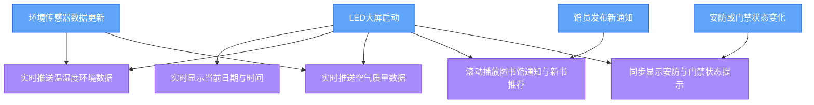

```mermaid
graph TD
  classDef trigger fill:#60a5fa,stroke:#2563eb,color:#fff
  classDef decision fill:#fbbf24,stroke:#d97706,color:#fff
  classDef action fill:#34d399,stroke:#059669,color:#fff
  classDef display fill:#a78bfa,stroke:#7c3aed,color:#fff
  A[LED大屏启动]:::trigger --> B[实时显示当前日期与时间]:::display
  A --> C[实时推送温湿度环境数据]:::display
  A --> D[实时推送空气质量数据]:::display
  A --> E[滚动播放图书馆通知与新书推荐]:::display
  A --> F[同步显示安防与门禁状态提示]:::display
  G[环境传感器数据更新]:::trigger --> C
  G --> D
  H[安防或门禁状态变化]:::trigger --> F
  I[馆员发布新通知]:::trigger --> E
```
