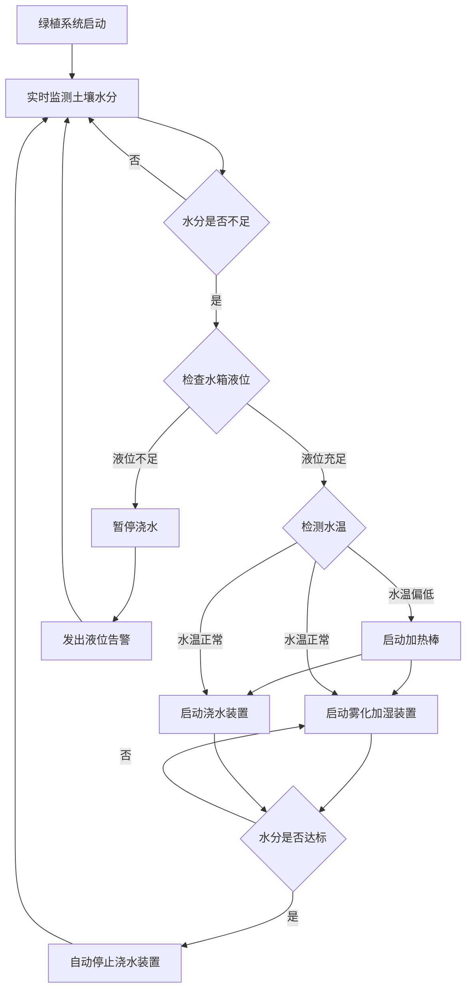

```mermaid
flowchart TD
    A[绿植系统启动] --> B[实时监测土壤水分]
    B --> C{水分是否不足}
    C -- 是 --> D{检查水箱液位}
    D -- 液位充足 --> E{检测水温}
    E -- 水温偏低 --> F[启动加热棒]
    F --> G[启动雾化加湿装置]
    F --> G2[启动浇水装置]
    E -- 水温正常 --> G
    E -- 水温正常 --> G2
    G --> H{水分是否达标}
    G2 --> H
    H -- 否 --> G
    H -- 是 --> I[自动停止浇水装置]
    I --> B
    D -- 液位不足 --> J[暂停浇水]
    J --> J2[发出液位告警]
    J2 --> B
    C -- 否 --> B
```
