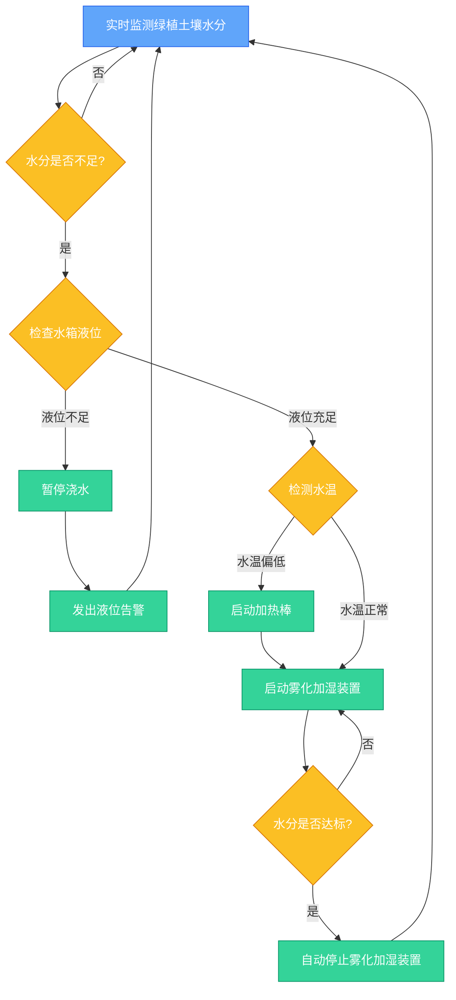

```mermaid
graph TD
  classDef trigger fill:#60a5fa,stroke:#2563eb,color:#fff
  classDef decision fill:#fbbf24,stroke:#d97706,color:#fff
  classDef action fill:#34d399,stroke:#059669,color:#fff
  classDef display fill:#a78bfa,stroke:#7c3aed,color:#fff
  A[实时监测绿植土壤水分]:::trigger --> B{水分是否不足?}:::decision
  B -->|否| A
  B -->|是| C{检查水箱液位}:::decision
  C -->|液位不足| D[暂停浇水]:::action
  D --> E[发出液位告警]:::action
  E --> A
  C -->|液位充足| F{检测水温}:::decision
  F -->|水温偏低| G[启动加热棒]:::action
  G --> H[启动雾化加湿装置]:::action
  F -->|水温正常| H
  H --> I{水分是否达标?}:::decision
  I -->|否| H
  I -->|是| J[自动停止雾化加湿装置]:::action
  J --> A
```
