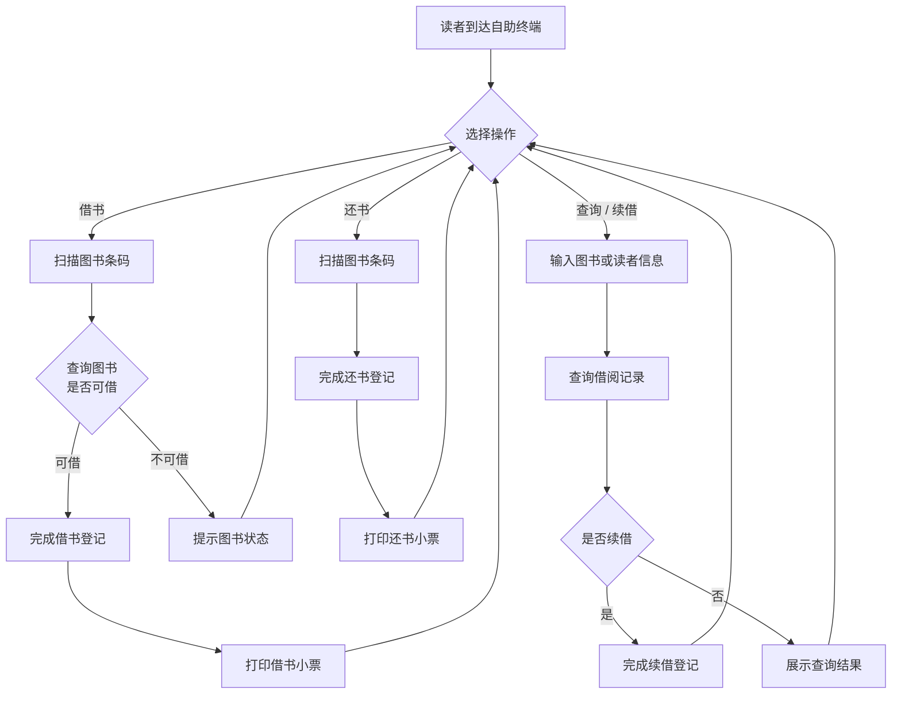

```mermaid
flowchart TD
    A[读者到达自助终端] --> B{选择操作}
    B -- 借书 --> C[扫描图书条码]
    C --> D{查询图书\n是否可借}
    D -- 可借 --> E[完成借书登记]
    E --> F[打印借书小票]
    F --> B
    D -- 不可借 --> G[提示图书状态]
    G --> B
    B -- 还书 --> H[扫描图书条码]
    H --> I[完成还书登记]
    I --> J[打印还书小票]
    J --> B
    B -- 查询 / 续借 --> K[输入图书或读者信息]
    K --> L[查询借阅记录]
    L --> M{是否续借}
    M -- 是 --> N[完成续借登记]
    N --> B
    M -- 否 --> O[展示查询结果]
    O --> B
```
