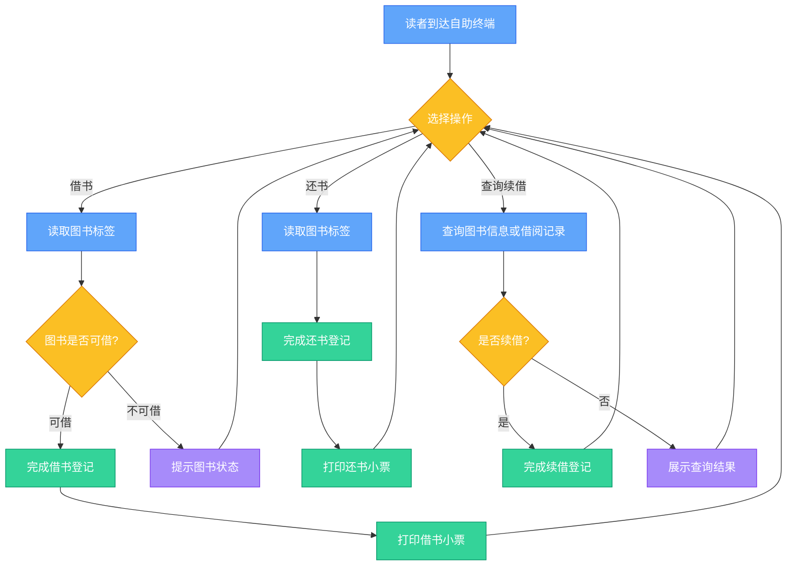

```mermaid
graph TD
  classDef trigger fill:#60a5fa,stroke:#2563eb,color:#fff
  classDef decision fill:#fbbf24,stroke:#d97706,color:#fff
  classDef action fill:#34d399,stroke:#059669,color:#fff
  classDef display fill:#a78bfa,stroke:#7c3aed,color:#fff
  A[读者到达自助终端]:::trigger --> B{选择操作}:::decision
  B -->|借书| C[读取图书标签]:::trigger
  C --> D{图书是否可借?}:::decision
  D -->|可借| E[完成借书登记]:::action
  E --> F[打印借书小票]:::action
  F --> B
  D -->|不可借| G[提示图书状态]:::display
  G --> B
  B -->|还书| H[读取图书标签]:::trigger
  H --> I[完成还书登记]:::action
  I --> J[打印还书小票]:::action
  J --> B
  B -->|查询续借| K[查询图书信息或借阅记录]:::trigger
  K --> L{是否续借?}:::decision
  L -->|是| M[完成续借登记]:::action
  M --> B
  L -->|否| N[展示查询结果]:::display
  N --> B
```
